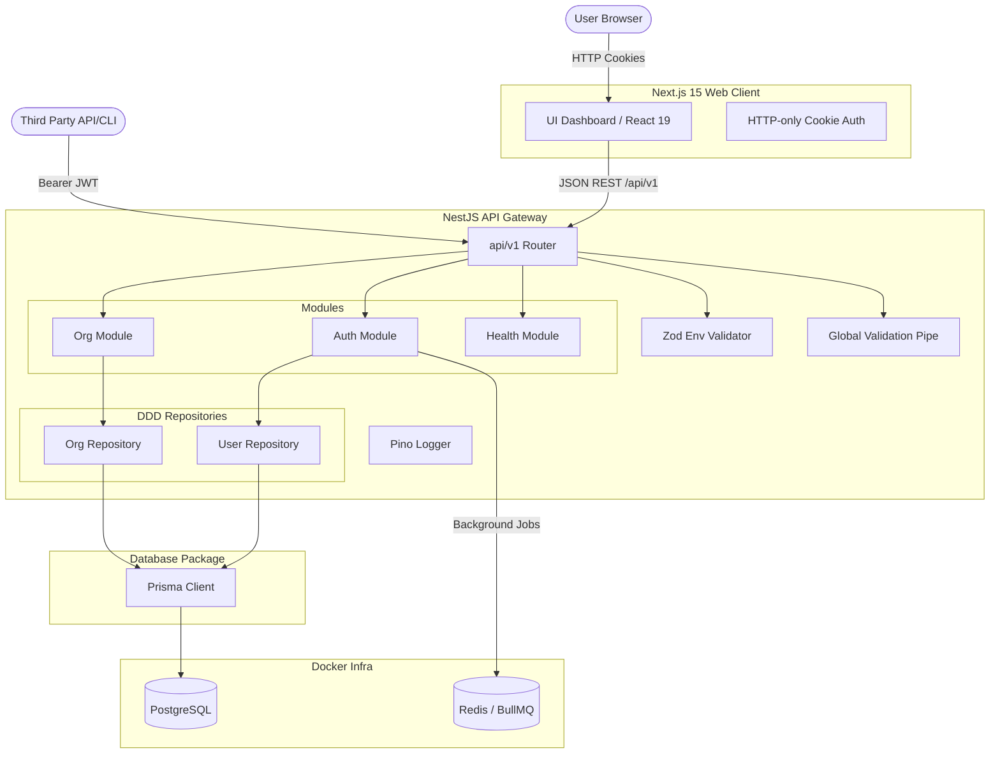

# AIOps Hub

[](https://github.com/sadiab47/AIOps_Hub/actions)
[](https://opensource.org/licenses/MIT)
[](https://nodejs.org)
[](https://pnpm.io)
[](https://github.com/sadiab47/AIOps_Hub/pulls)

A production-ready, multi-tenant **AI Automation Platform** designed as a reusable foundation for premium enterprise consulting. 

---

## 🚀 Key Features

* **Multi-Tenant Architecture**: Deep database division from Day 1 utilizing PostgreSQL schemas, user memberships, and role-based access control (RBAC).
* **Robust Backend Design**: Built on **NestJS**, utilizing a framework-isolated Repository pattern separating business logic from Prisma ORM interfaces.
* **Modern Frontend**: Built with **Next.js 15**, React 19, Tailwind CSS, and global state management.
* **Auditing & Soft Deletes**: Built-in tracking of database entities with soft-deletes (`deletedAt`) and detailed audit logs.
* **Production Observability**: Built-in global validation pipes via `class-validator`, Zod-based environment configurations, and high-performance Pino logging.
* **Local Infrastructure Services**: Self-contained local Postgres & Redis instances managed via Docker Compose.

---

## 🏛️ System Architecture



---

## 📂 Repository Workspace Structure

We orchestrate our monorepo using **Turborepo** and **pnpm workspaces**:

```text
aiops-hub/
├── apps/
│   ├── web/               # Next.js 15 Frontend
│   └── api/               # NestJS API backend
├── packages/
│   ├── db/                # Shared Database client & Prisma models
│   ├── tsconfig/          # Shared tsconfig blueprints
│   └── eslint-config/     # Shared linting configs
├── infra/
│   └── docker/            # Local Docker Compose setup (Postgres, Redis)
├── scripts/               # Project automation and setup utilities
├── docs/                  # Architecture Decision Records (ADRs) & guides
└── package.json           # Monorepo root configuration
```

---

## ⚙️ Local Development Quickstart

### Prerequisites

- [Node.js](https://nodejs.org) >= 22.0.0
- [pnpm](https://pnpm.io) >= 11.0.0
- [Docker Desktop](https://www.docker.com/products/docker-desktop/)

### 1. Installation

Install all workspace dependencies and link packages:
```bash
pnpm install
```

### 2. Infrastructure Setup

Launch the local PostgreSQL database and Redis services:
```bash
docker compose -f infra/docker/docker-compose.yml up -d
```

### 3. Database Migration & Client Generation

Synchronize the database schema and generate the type-safe Prisma client:
```bash
pnpm --filter @aiops-hub/db db:migrate
pnpm --filter @aiops-hub/db db:generate
```

### 4. Running the Applications

Start all applications in development mode with hot-reloading:
```bash
pnpm dev
```

- **Frontend dashboard**: [http://localhost:3000](http://localhost:3000)
- **REST API health check**: [http://localhost:3001/api/v1/health](http://localhost:3001/api/v1/health)

---

## 🤝 Contribution Guidelines

Please read [CONTRIBUTING.md](CONTRIBUTING.md) for details on coding standards, conventional commit messages, and our branching strategies. We strictly adhere to our [Code of Conduct](CODE_OF_CONDUCT.md).

## 📄 License

This project is licensed under the MIT License - see the [LICENSE](LICENSE) file for details.
