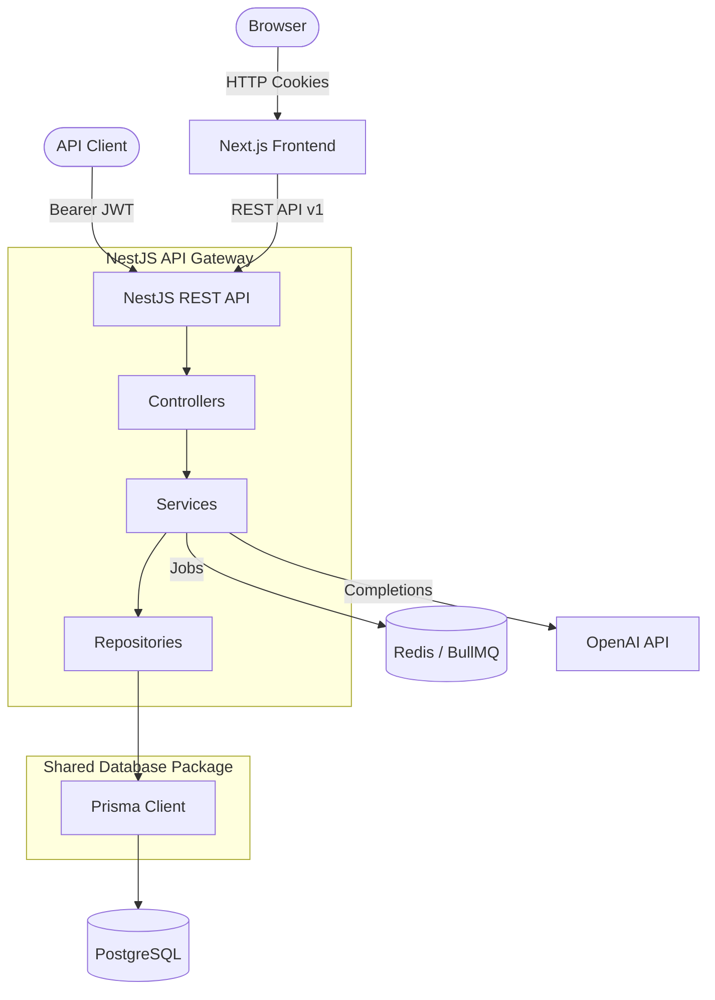

# 🚀 AIOps Hub

> **Enterprise AI Automation Platform for Knowledge Management, Intelligent Agents, and Workflow Automation**

Build AI-powered knowledge bases, intelligent assistants, workflow automations, and enterprise business applications on a scalable, multi-tenant architecture.

Designed for production from day one.

---

[](#)
[](#)


---

### 📊 Project Metrics & Architecture
| Metric | Value | Details |
| :--- | :--- | :--- |
| **Architecture** | Monorepo / Modular Monolith | Next.js 15, NestJS 11, Turborepo |
| **Database** | PostgreSQL & Redis | Prisma ORM |
| **Tests** | 30 Tests | 100% Passing |
| **Security** | JWT Access & Stateful Refresh | Cookie-based, rotation on refresh |
| **CI/CD** | Enabled | GitHub Actions validation |

### 🔐 Authentication Module Release Summary
- **Features**: 5 Core Features (Registration, Login, Refresh Rotation, Idempotent Logout, Current User Profile)
- **Status**: 100% Complete & Verified (30 passing tests)
- **Standards**: SHA-256 Refresh Hashing, XSS isolation (HTTP-only cookies), multi-device tracking, automated reuse detection.

---

## 💡 Why AIOps Hub?

Typical AI boilerplates focus on simple OpenAI API calls. AIOps Hub is designed for production consulting environments, offering structured logical tenant isolation, framework-agnostic repositories, and highly-scalable background jobs.

---

## 🎯 Vision

AIOps Hub is an enterprise-grade, multi-tenant Software-as-a-Service (SaaS) platform designed for workflow automation, custom AI agents, knowledge bases, and advanced operational integrations. Built with a robust modular monolith architecture, this codebase serves as a world-class foundation for premium AI consulting projects.

---

## ⚡ Features

* **✅ Enterprise Authentication**: Hybrid authentication supporting secure HTTP-only cookies for web apps and Bearer JWTs for APIs, CLIs, and agents.
* **✅ Multi-Tenant Organizations**: Complete logical separation of tenants with separate workspaces and contexts.
* **✅ Role Based Access Control**: Granular permission hierarchies (Owner, Admin, Manager, Member, Viewer).
* **✅ AI Knowledge Base**: Embeddings generation, RAG, and document search.
* **✅ AI Chat**: Direct conversational assistant with detailed citations.
* **✅ AI Agents**: Stateful multi-agent workflows orchestrating business logic.
* **✅ Workflow Automation**: Custom sequence design and automated integrations.
* **✅ Document Intelligence**: Automated document parsing, extraction, and structure parsing.
* **✅ Background Jobs**: High-throughput queues powered by BullMQ.
* **✅ REST APIs**: Explicitly versioned (`/api/v1`) REST endpoints.
* **✅ Docker**: Containerized Postgres & Redis for reproducible local runtimes.
* **✅ CI/CD**: Automatic linting, type-checking, and build validation on GitHub Actions.
* **✅ Enterprise Logging**: Structured JSON logging powered by Pino and nestjs-pino.

---

## 🎨 Design Principles

1. **Separation of Concerns**: Business logic is decoupled from frameworks, APIs, and ORMs.
2. **Explicit Contracts**: Mandatory schemas for environment parameters (Zod) and incoming payloads (class-validator).
3. **Data Integrity**: Soft deletes, UUID identifiers, and audit logs are baked in from the foundation.

---

## 🏛️ System Architecture

### Component Diagram

```text
                    Browser
                       │
                Next.js Frontend
                       │
               REST API (NestJS)
                       │
      ┌────────────────┼────────────────┐
      │                │                │
 PostgreSQL          Redis          OpenAI
      │                │                │
      └───────────── Prisma ────────────┘
```

### System Data Flow



---

## 🛠️ Tech Stack

* **Frontend**: Next.js 15, React 19, TypeScript, Tailwind CSS, Lucide Icons, TanStack Query, Zustand.
* **Backend**: NestJS, Prisma Client, `@nestjs/terminus` (Health checks).
* **AI (Sprint 3+)**: OpenAI Responses API, LangGraph, MCP, Qdrant.
* **DevOps & DB**: Docker, PostgreSQL 16, Redis 7, GitHub Actions CI/CD.

---

## 📂 Repository Structure

* **`apps/`**: The core executable applications:
  * **`apps/web`**: Next.js 15 frontend application.
  * **`apps/api`**: NestJS backend REST API application.
* **`packages/`**: Reusable workspace packages:
  * **`packages/db`**: Prisma schema, migration configurations, and client exports.
  * **`packages/tsconfig`**: Shared TypeScript compiler configs.
  * **`packages/eslint-config`**: Shared linting and code quality configs.
* **`infra/`**: DevOps assets:
  * **`infra/docker`**: Local Docker Compose environment configuration.
* **`docs/`**: Production-grade architectural documentation, ADRs, and guides.
* **`scripts/`**: Utility automation (labels configuration, setup scripts).

---

## ⚙️ Quick Start

### Prerequisites
- Node.js >= 22.0.0
- pnpm >= 11.0.0
- Docker Desktop

### 1. Clone & Install
```bash
git clone https://github.com/sadiab47/AIOps_Hub.git
cd AIOps_Hub
pnpm install
```

### 2. Start Docker Services
```bash
docker compose -f infra/docker/docker-compose.yml up -d
```

### 3. Generate Database Client & Run Migrations
```bash
pnpm --filter @aiops-hub/db db:migrate
pnpm --filter @aiops-hub/db db:generate
```

### 4. Start Development Mode
```bash
pnpm dev
```

---

## 📅 Roadmap

### Sprint Progress

- **✅ Sprint 0** – Infrastructure & Foundation
- **🚧 Sprint 1** – Authentication & Organizations (In Progress)
- **⏳ Sprint 2** – File Management
- **⏳ Sprint 3** – AI Knowledge Base
- **⏳ Sprint 4** – AI Agents
- **⏳ Sprint 5** – Workflow Automation
- **⏳ Sprint 6** – Production Deployment

---

## 📸 Screenshots

*Screenshots and demo clips will be added as features are completed in upcoming Sprints.*

---

## 📖 Documentation

* [Vision Document](docs/00-vision.md)
* [System Architecture](docs/03-system-architecture.md)
* [Database Design](docs/04-database-design.md)
* [API Specification](docs/05-api-specification.md)
* [Architecture Decision Records (ADRs)](docs/ADR/README.md)
* [Deployment Guide](docs/10-deployment.md)

---

## 🤝 Contributing

Contributions are welcome! Please read [CONTRIBUTING.md](CONTRIBUTING.md) to align on our coding standards, branch conventions, and conventional commit message structures.

## 📄 License

Licensed under the MIT License. See [LICENSE](LICENSE) for details.
