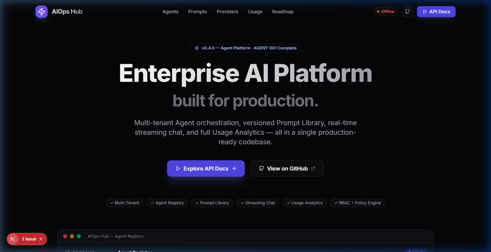
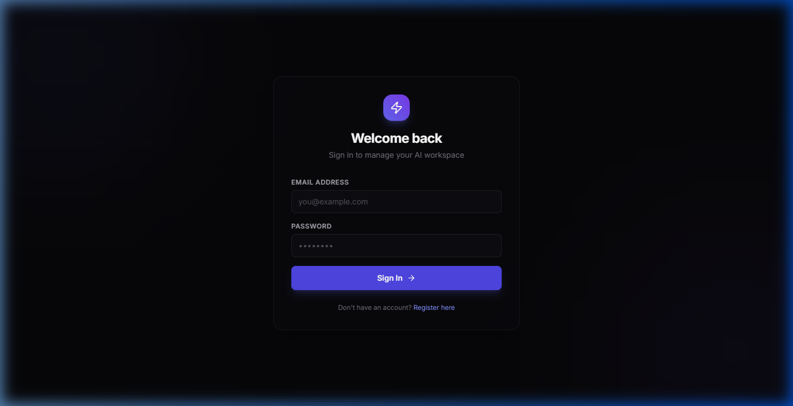
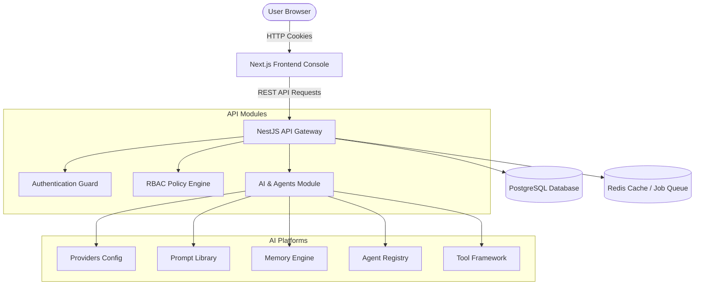

# 🚀 AIOps Hub

> **Enterprise AI Automation Platform for Knowledge Management, Intelligent Agents, and Workflow Automation**

Build AI-powered knowledge bases, intelligent assistants, workflow automations, and enterprise business applications on a scalable, multi-tenant architecture.

---

[](#)
[](#)


---

## 🎨 Console Previews

### Landing Page Showcase


### Secure Console Access


---

## 📊 Project Metrics & Architecture
| Metric | Value | Details |
| :--- | :--- | :--- |
| **Architecture** | Monorepo / Modular Monolith | Next.js 15 App Router, NestJS 11, Turborepo |
| **Database** | PostgreSQL & Redis | Prisma ORM |
| **Tests** | 30+ Integration Specs | 100% Passing |
| **Security** | JWT Access & Stateful Refresh | Cookie-based, rotation on refresh, CSRF safeguards |
| **UI Components** | Reusable UI Kit | Monaco Editor, Recharts analytics, PageHeader, StatCard, DataTable |

---

## ⚡ Features

* **✅ Enterprise Authentication**: Hybrid authentication supporting secure HTTP-only cookies for Next.js web console and Bearer JWTs for REST API integrations.
* **✅ Multi-Tenant Isolation**: Complete logical separation of client organizations with switcher matrices and tenant context header guards.
* **✅ Fine-Grained RBAC**: Granular permission hierarchies (Owner, Admin, Manager, Member, Viewer) mapped via pure policy engines.
* **✅ Agent Registry (v0.4.0)**: Central agent registrations with optimistic locking revision counters and lifecycle state scopes (`DRAFT`, `ACTIVE`, `DISABLED`, `ARCHIVED`).
* **✅ Tool Execution Framework (v0.4.0)**: Schema-validated executor registry hosting Calculator, DateTime, UUID, JSON utilities, and whitelisted HTTP tools.
* **✅ Console Dashboard**: Reusable UI component layer featuring Monaco Editor workspace, 5-step Agent wizards, and Recharts cost analytics.

---

## 🏛️ System Architecture

### Component Architecture Flow


```mermaid
graph TD
    Browser([User Browser]) -->|HTTP Cookies| NextJS[Next.js Frontend Console]
    NextJS -->|REST API Requests| API[NestJS API Gateway]
    
    subgraph API Modules
        API --> Auth[Authentication Guard]
        API --> RBAC[RBAC Policy Engine]
        API --> AI[AI & Agents Module]
    end

    subgraph AI Platforms
        AI --> Providers[Providers Config]
        AI --> Prompts[Prompt Library]
        AI --> Memory[Memory Engine]
        AI --> Registry[Agent Registry]
        AI --> Tools[Tool Framework]
    end

    API --> DB[(PostgreSQL Database)]
    API --> Cache[(Redis Cache / Job Queue)]
```

---

## 📂 Repository Structure

* **`apps/`**: The core executable applications:
  * **`apps/web`**: Next.js 15 frontend application with modular `src/features/` folder patterns.
  * **`apps/api`**: NestJS backend REST API application.
* **`packages/`**: Reusable workspace packages:
  * **`packages/db`**: Prisma schema, migrations configs, and client declarations exports.
  * **`packages/tsconfig`**: Shared TypeScript compiler configs.
  * **`packages/eslint-config`**: Shared linting and code quality configs.
* **`infra/`**: DevOps assets:
  * **`infra/docker`**: Local Docker Compose environment configuration.
* **`docs/`**: Production-grade architectural documentation, ADRs, and guides.

---

## ⚙️ Quick Start

### Prerequisites
- Node.js >= 22.0.0
- pnpm >= 11.0.0
- Docker Desktop

### 1. Provision Local Services
Clone the repository and spin up PostgreSQL and Redis services:
```bash
docker compose -f infra/docker/docker-compose.yml up -d
```

### 2. Install Dependencies & Build Workspace
```bash
pnpm install
pnpm run build
```

### 3. Apply Schema Migrations
```bash
npx pnpm --filter @aiops-hub/db db:generate
npx pnpm --filter @aiops-hub/db db:push
```

### 4. Run Development Servers
```bash
npm run dev
```
- Frontend: `http://localhost:3000`
- Backend API: `http://localhost:4000`

---

## 📅 Roadmap & Project Status

### Project Status: `v0.4.0-dev`
Current focus: **Frontend Console Shell integration & Agent Orchestration Engines**. All core multi-tenant databases, RBAC layers, and tool executors are fully tested and functional.

### Upcoming Milestones
- **⬜ AGENT-003**: Agent Execution Engine (loop executor, SSE stream dispatcher, execution traces).
- **⬜ AGENT-004**: Playground Live Chat Console interface.
- **⬜ AGENT-005**: Sequential workflow orchestration pipelines.
