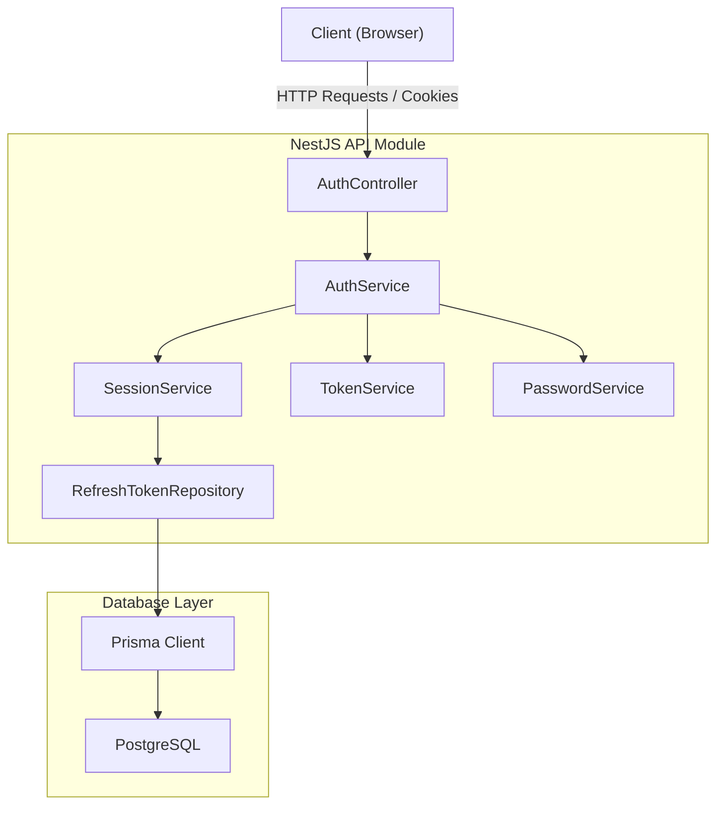
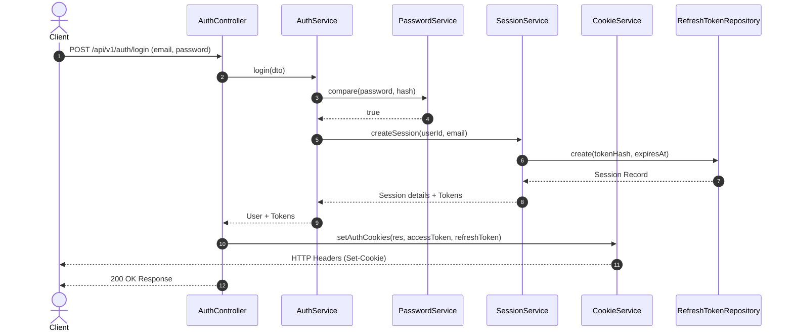
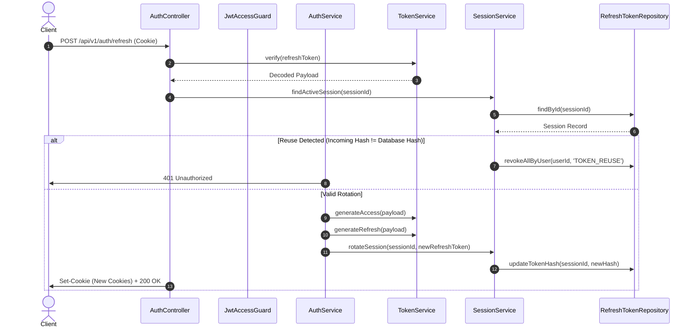
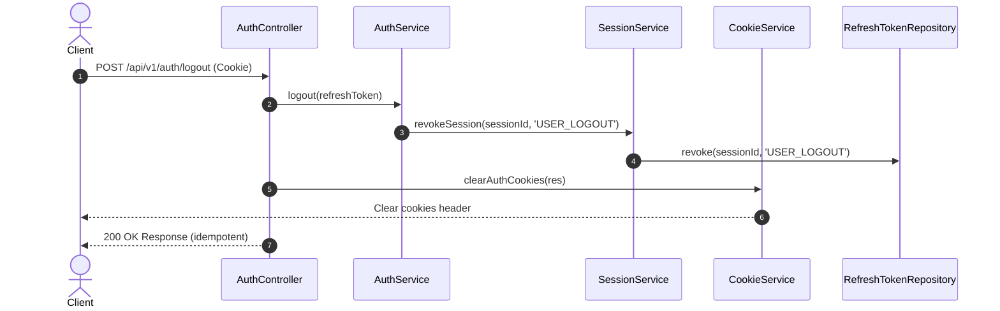

# Authentication Architecture

This document provides a comprehensive overview of the authentication system implemented in AIOps Hub. It details the module structures, request lifecycles, cookie management, session rotations, and security countermeasures.

---

## 1. Overview

The authentication module is designed as a secure, stateless-JWT-access and stateful-session-refresh hybrid model.
- **Access Tokens**: Short-lived (15 minutes), stateless JWTs carried via secure cookies for sub-millisecond API request authorization.
- **Refresh Tokens**: Long-lived (30 days), stateful tokens tracked in the PostgreSQL database via Prisma. Every single refresh request triggers a **rotation** (revoking the old refresh token and issuing a brand new one) to mitigate replay attacks.

---

## 2. Folder Structure

```
apps/api/src/
├── common/
│   └── auth/
│       ├── cookie.service.ts         # Handles reading, writing, and clearing cookies
│       ├── password.service.ts       # Bcrypt wrapper for passwords hashing/comparison
│       ├── token.service.ts          # Generates and validates stateless access/refresh JWTs
│       ├── jwt-access.guard.ts       # CanActivate Guard validating access token cookies
│       └── current-user.decorator.ts # Custom decorator extracting user payloads from requests
└── modules/
    └── auth/
        ├── controllers/
        │   └── auth.controller.ts    # Routes: /register, /login, /refresh, /logout, /logout-all, /me
        ├── dto/
        │   ├── login.dto.ts
        │   └── register.dto.ts
        ├── repositories/
        │   ├── refresh-token-repository.interface.ts
        │   └── refresh-token.repository.ts
        └── services/
            ├── auth.service.ts       # Orchestrates registration, login, and token validations
            └── session.service.ts    # Manages database session lifecycles and token rotations
```

---

## 3. Architecture & Request Flow

The architecture follows a strict decoupled design separating REST controllers, domain services, session handlers, and physical database repositories.



---

## 4. Session Lifecycle & Flow Diagrams

### Login Flow
Exposes `POST /api/v1/auth/login`. Validates credentials, creates a stateful session record, hashes the refresh token using SHA-256 before storage, and attaches the HTTP-only cookies to the response header.



### Refresh & Rotation Flow
Exposes `POST /api/v1/auth/refresh`. When a client exchanges their refresh token, the old token is immediately invalidated. A new refresh token is issued, hashed, and updated on the existing session record. 

If a refresh token is reused (indicating a stolen token replay attack), **all active sessions** for that user are immediately revoked.



### Logout Flow
Exposes `POST /api/v1/auth/logout` (single device session) and `POST /api/v1/auth/logout-all` (all multi-device sessions). Both routes are fully idempotent. If a token is already revoked or missing, the controller still clears the client-side cookies and returns `200 OK` safely.



---

## 5. Repositories & Database Schema

The sessions are stored in the `refresh_tokens` database table. The table maps a unique session identifier (`id`) to a hashed value of the current active token:

```prisma
model RefreshToken {
  id            String    @id @default(uuid()) @db.Uuid
  userId        String    @db.Uuid
  tokenHash     String    @unique
  userAgent     String?
  ipAddress     String?
  expiresAt     DateTime
  revokedAt     DateTime?
  revokedReason String?
  createdAt     DateTime  @default(now())
  updatedAt     DateTime  @updatedAt
  user          User      @relation(fields: [userId], references: [id], onDelete: Cascade)

  @@index([userId])
  @@map("refresh_tokens")
}
```

---

## 6. Security Countermeasures

- **XSS Mitigation**: Both `aiops_access_token` and `aiops_refresh_token` cookies are set with `httpOnly: true`, preventing access from client-side scripts.
- **CSRF Mitigations**: Cookies enforce `sameSite: 'strict'` to block cross-site execution vectors.
- **Token Hashing**: Refresh tokens are never stored in plain-text. They are hashed using SHA-256 inside `SessionService` before database persistence.
- **Idempotency Protection**: Logouts do not leak details. Inactive, expired, or double-logout commands clear cookies and report 200 success without executing unnecessary database actions.
- **Device-level Isolation**: User agent and IP address logs map token sessions, allowing targeted invalidation on security breaches.
- **Account Disablement Check**: The `GET /me` profile endpoint performs an active status validation. If a user is locked or disabled after token issuance, their stateless access token is immediately rejected.
