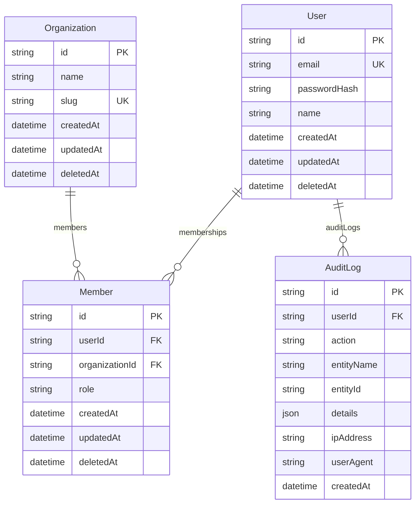

# Database ERD

```mermaid
erDiagram
    User ||--o{ Member : memberships
    User ||--o{ AuditLog : auditLogs
    Organization ||--o{ Member : members
    Organization {
        string id PK
        string name
        string slug UK
        datetime createdAt
        datetime updatedAt
        datetime deletedAt
    }
    User {
        string id PK
        string email UK
        string passwordHash
        string name
        datetime createdAt
        datetime updatedAt
        datetime deletedAt
    }
    Member {
        string id PK
        string userId FK
        string organizationId FK
        string role
        datetime createdAt
        datetime updatedAt
        datetime deletedAt
    }
    AuditLog {
        string id PK
        string userId FK
        string action
        string entityName
        string entityId
        json details
        string ipAddress
        string userAgent
        datetime createdAt
    }
```
