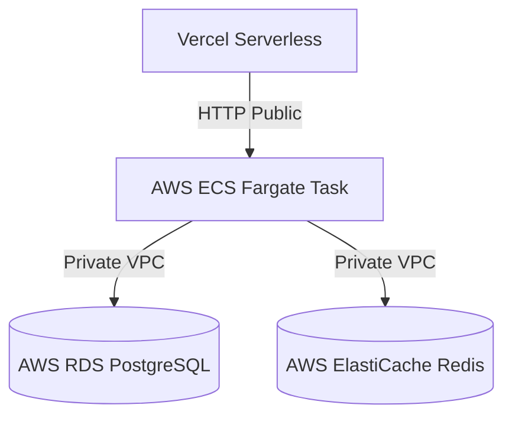

# Deployment Diagram

```mermaid
graph TD
    Vercel[Vercel Serverless] -->|HTTP Public| Fargate[AWS ECS Fargate Task]
    Fargate -->|Private VPC| RDS[(AWS RDS PostgreSQL)]
    Fargate -->|Private VPC| Cache[(AWS ElastiCache Redis)]
```
