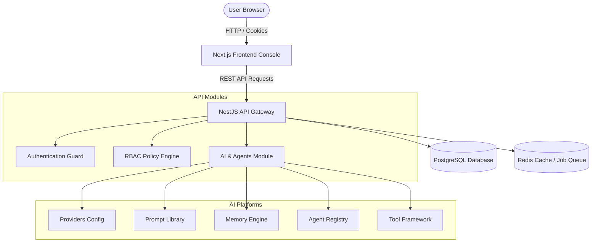

# System Architecture Diagram

```mermaid
graph TD
    Browser([User Browser]) -->|HTTP / Cookies| NextJS[Next.js Frontend Console]
    NextJS -->|REST API Requests| API[NestJS API Gateway]
    
    subgraph API Modules
        API --> Auth[Authentication Guard]
        API --> RBAC[RBAC Policy Engine]
        API --> AI[AI & Agents Module]
    end

    subgraph AI Platforms
        AI --> Providers[Providers Config]
        AI --> Prompts[Prompt Library]
        AI --> Memory[Memory Engine]
        AI --> Registry[Agent Registry]
        AI --> Tools[Tool Framework]
    end

    API --> DB[(PostgreSQL Database)]
    API --> Cache[(Redis Cache / Job Queue)]
```
