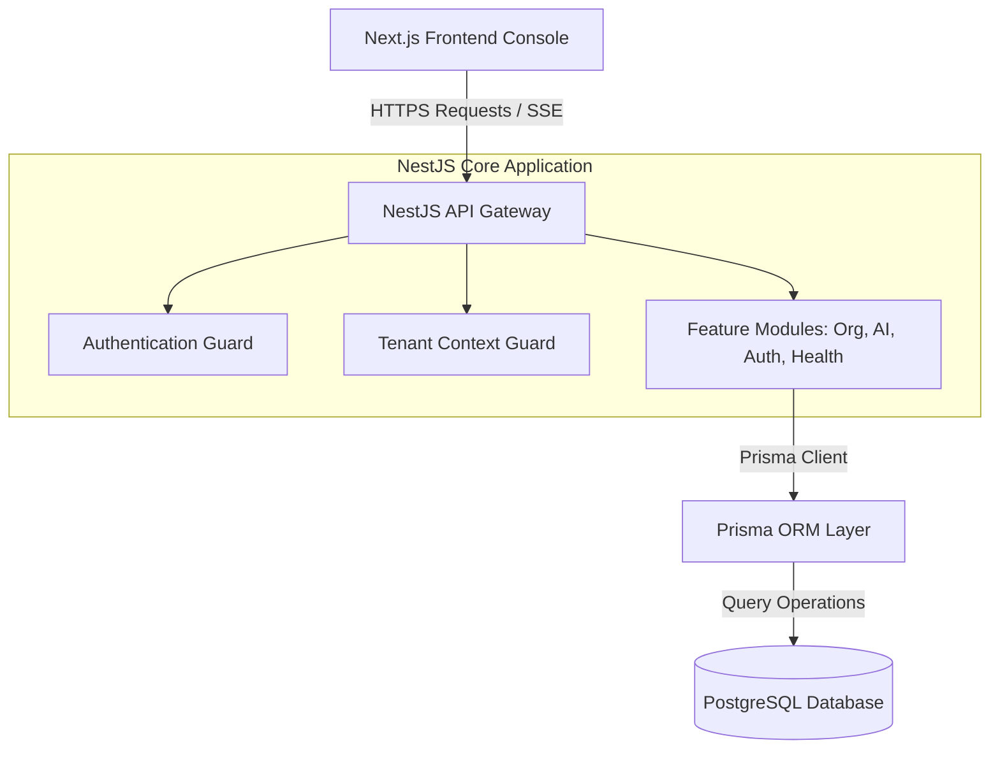
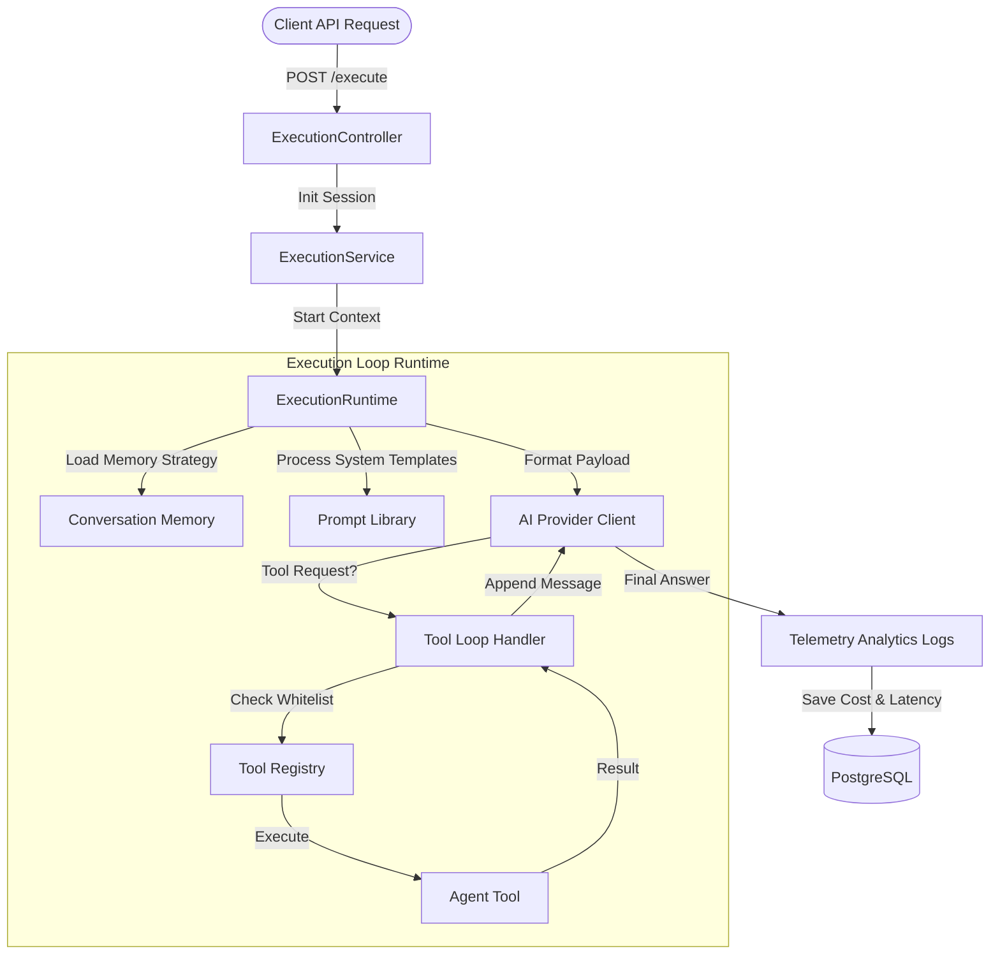
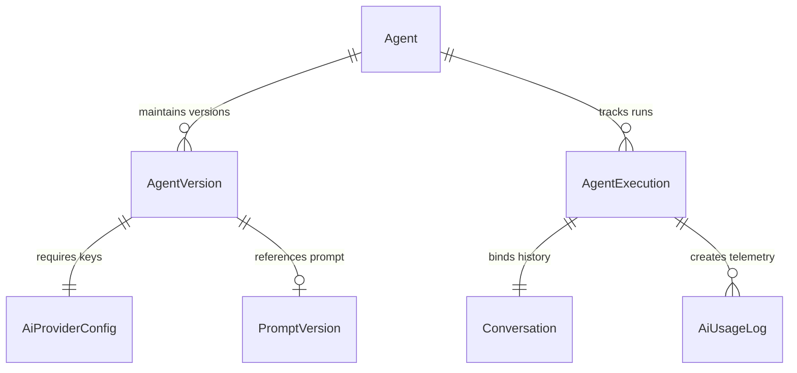

# System Architecture Diagrams

This document outlines the architecture flows of the AIOps Hub platform.

## 1. Platform Hierarchy

## 2. Agent Execution Runtime Flow (AGENT-003)

## 3. Agent Configuration & Relations Structure

